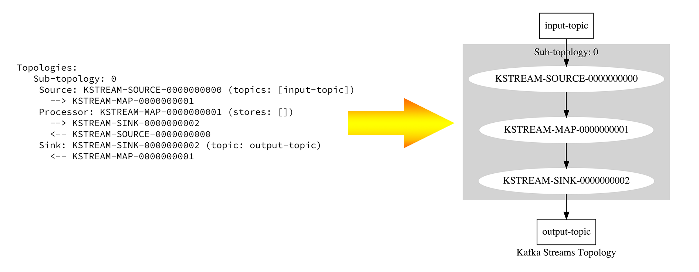

# Kafka topology viz

A port from https://raw.githubusercontent.com/zz85/kafka-streams-viz to render a topology description to an image in kotlin.



## Quick start
🚧 Add gradle import 🚧

```kotlin
import ktopologyviz.saveTopologyImage
import ktopologyviz.renderTopology

val topology: org.apache.kafka.streams.Topology 
val topologyDescription : String = topology.describe()

// Save an image with the topology diagram
saveTopologyImage(topologyDescription, "myTopologyDiagram.png")

// Render only into a buffered image
renderTopology(topologyDescription)
```

## Credits
Parsing logic ported from: [zz85/kafka-streams-viz](https://raw.githubusercontent.com/zz85/kafka-streams-viz)  
Render **dot** files with: [nidi3/graphviz-java](https://github.com/nidi3/graphviz-java)